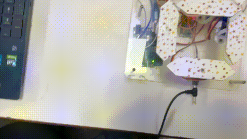
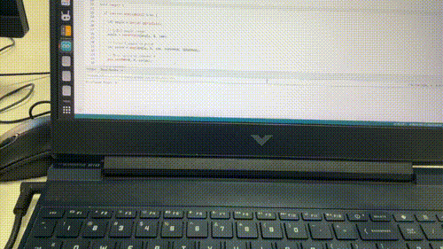
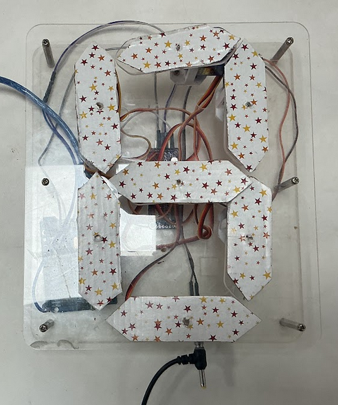
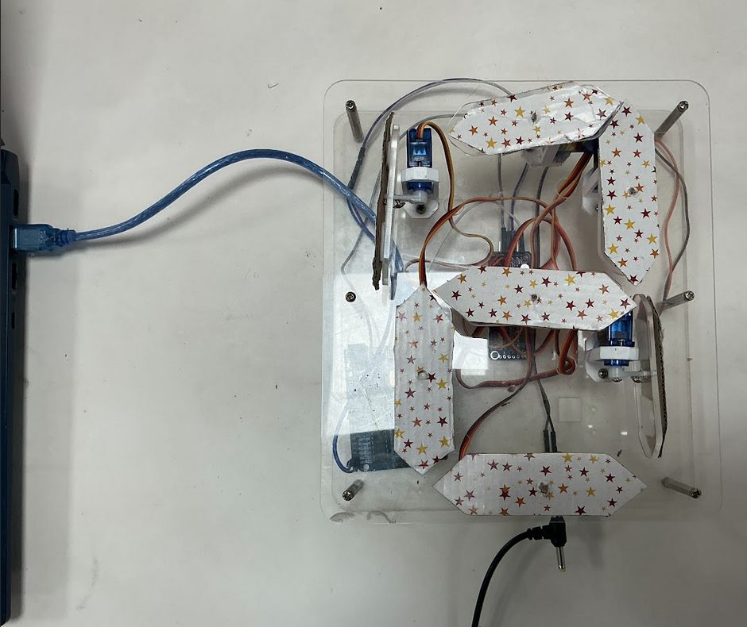
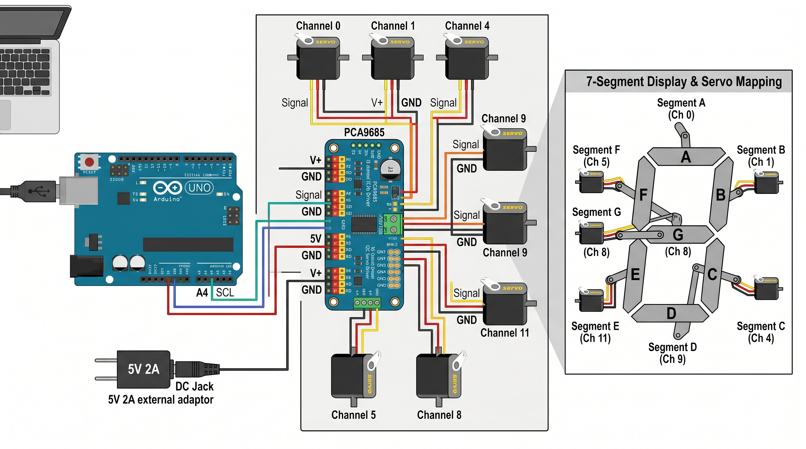

# 🔢 Servo-Based Number Display System

A multi-servo robotic number display system developed using **Arduino UNO** and the **PCA9685 Servo Driver Module**.  
The project controls multiple servo motors simultaneously to form numeric patterns from **0 to 9** and also allows real-time user input through the Serial Monitor.

  

  

  

---

## 📱 Features

- Multi-servo synchronized movement
- Displays digits from `0` to `9`
- PCA9685 servo driver support
- User input through Serial Monitor
- Real-time servo control
- Custom servo angle constraints
- Automated demo sequence

  

  

  

---

## 🛠️ Hardware Used

- Arduino UNO
- PCA9685 16-Channel Servo Driver
- Servo Motors
- External Power Supply
- Jumper Wires

  

---

## 💻 Software Used

- Arduino IDE
- Adafruit PWM Servo Driver Library

---

## 🚀 How It Works

1. The system initializes all servos
2. A demo sequence automatically displays digits `0 → 9`
3. After the demo, the user can:
   - Enter any digit (`0-9`) in the Serial Monitor
4. The servos move together to form the selected number

---

## 🎮 User Controls

### Serial Monitor Input

| Input | Action |
|---|---|
| `0` | Display digit 0 |
| `1` | Display digit 1 |
| `2` | Display digit 2 |
| `3` | Display digit 3 |
| `4` | Display digit 4 |
| `5` | Display digit 5 |
| `6` | Display digit 6 |
| `7` | Display digit 7 |
| `8` | Display digit 8 |
| `9` | Display digit 9 |

---

## ⚙️ Servo Channels Used

| Servo Channel | Purpose |
|---|---|
| Channel 0 | Segment Control |
| Channel 1 | Segment Control |
| Channel 4 | Segment Control |
| Channel 5 | Segment Control |
| Channel 8 | Segment Control |
| Channel 9 | Segment Control |
| Channel 11 | Segment Control |

---

## 📚 Learning Objectives

- Multi-servo synchronization
- PCA9685 interfacing
- Arduino serial communication
- Real-time robotic control
- Motion coordination
- Embedded systems programming

---

## 📦 Applications

- Robotic displays
- Educational robotics
- Automated mechanical systems
- Interactive installations
- Servo synchronization projects

---

## 👨‍💻 Author

**Pulkit Garg**

---